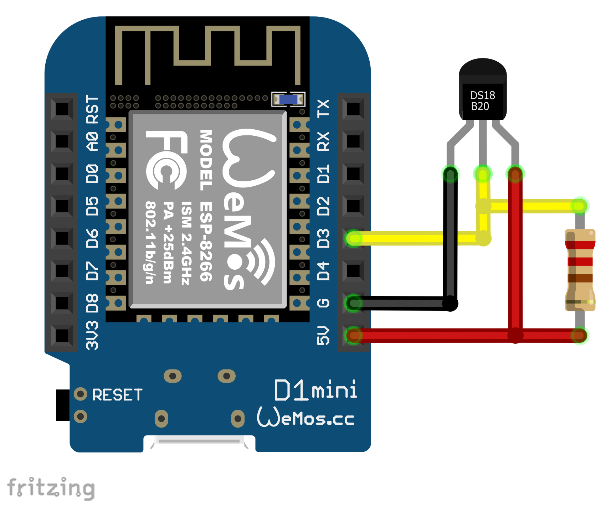

# Temp2IoT
Very basic IoT thermometer with REST API and Web-UI. Implemented according to the "KISS" approach - **K**eep **I**t **S**imple and **S**tupid

## Features
* Temperature measurement at two measuring points using DS18B20 sensors
* Shows the measured values on integrated Web UI
* REST API for integration with master systems


## Hardware

### BOM
* WeMos D1 mini
* DS18B20
* Resistor 4K7 (1/4 W) 

<p align="center">
  
</p>

## REST API
URL: `http://<Temp2IoT IP>/temp`
Method: `GET`

```
{
  "secure_counter": 3,
  "symbol": "°C",
  "temperature": "25.63",
  "unit": "Celsius"
}
```
