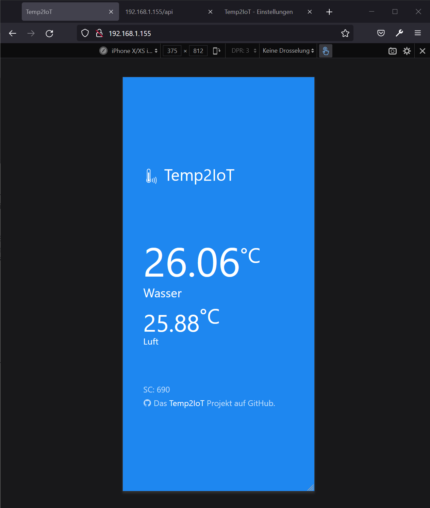

# Temp2IoT
Very basic IoT thermometer with REST API and Web-UI. Implemented according to the "KISS" approach - **K**eep **I**t **S**imple and **S**tupid

## Features
* Temperature measurement at one measuring points using a DS18B20 sensor
* Shows the measured values on integrated Web UI
* REST API for integration with master systems


## Hardware

### BOM
* [WeMos D1 mini](https://www.amazon.de/IZOKEE-NodeMcu-Internet-Entwicklungsboard-Compatible/dp/B076FBY2V3/ref=as_li_ss_tl?__mk_de_DE=%C3%85M%C3%85%C5%BD%C3%95%C3%91&dchild=1&qid=1592418090&sr=8-5&linkCode=ll1&tag=100prznt-21&linkId=f3bde55472d2f2ab4ed9c8f40f638c63&language=de_DE)
* [DS18B20](https://www.amazon.de/dp/B07THK58HZ/ref=as_li_ss_tl?psc=1&pd_rd_i=B07THK58HZ&pd_rd_w=TGL74&pf_rd_p=d3e24f85-c2f2-4959-bef4-3acc5e4e81dc&pd_rd_wg=A3WRB&pf_rd_r=X37HF7ZJ44633Y9M4PCM&pd_rd_r=4a531349-a32b-4541-8ff9-788a774e66cb&spLa=ZW5jcnlwdGVkUXVhbGlmaWVyPUEyU1dRS0lBWUVCTTRRJmVuY3J5cHRlZElkPUEwOTM4MzczMkxMUllKRDA2MlZKUSZlbmNyeXB0ZWRBZElkPUEwOTg2ODAzMVNUTTE4RzQ1WEVWOCZ3aWRnZXROYW1lPXNwX2RldGFpbCZhY3Rpb249Y2xpY2tSZWRpcmVjdCZkb05vdExvZ0NsaWNrPXRydWU=&linkCode=ll1&tag=100prznt-21&linkId=0dc38a880e2eaa75ad446c9fc781f950&language=de_DE)
* [Resistor 4K7 (1/4 W)](https://www.amazon.de/10-St%C3%BCck-Metallschichtwiderst%C3%A4nde-Watt-kOhm/dp/B01LXS3YX2/ref=as_li_ss_tl?__mk_de_DE=%C3%85M%C3%85%C5%BD%C3%95%C3%91&dchild=1&keywords=widerstand+4k7&qid=1592418150&sr=8-17&linkCode=ll1&tag=100prznt-21&linkId=6a3010cb892f7c3a93626a7539130374&language=de_DE)

<p align="center">
  
</p>

<p align="center">
  
</p>
Minimal build up, with SMD resistor on the back.

## REST API
* URL: `http://<Temp2IoT IP>/api`
* Method: `GET`

```
{
  "secure_counter": 3,
  "symbol": "°C",
  "temperature": "25.63",
  "unit": "Celsius"
}
```

## Web UI


Web UI on a desktop browser


Web UI on a smartphone browser