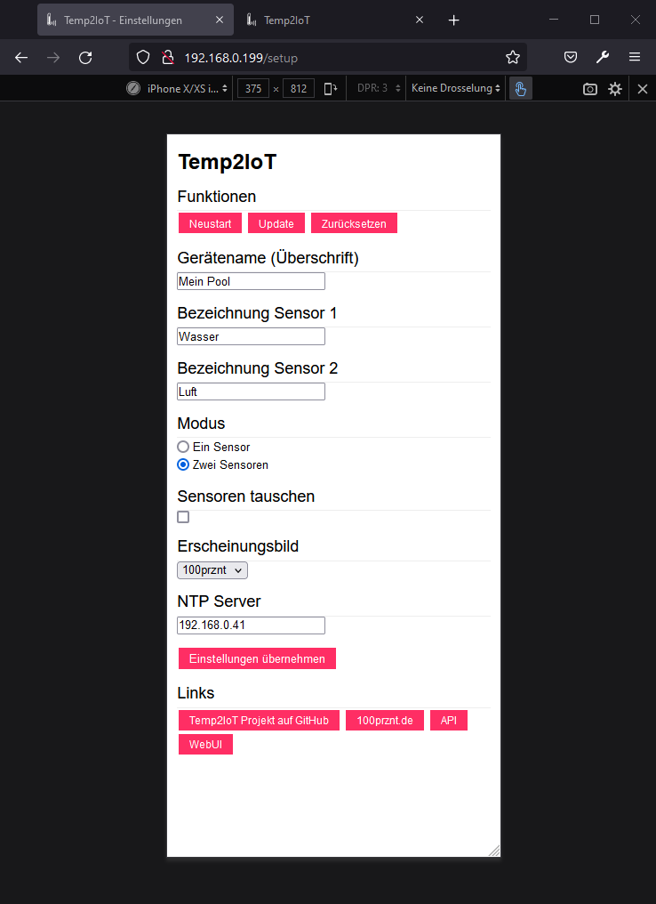
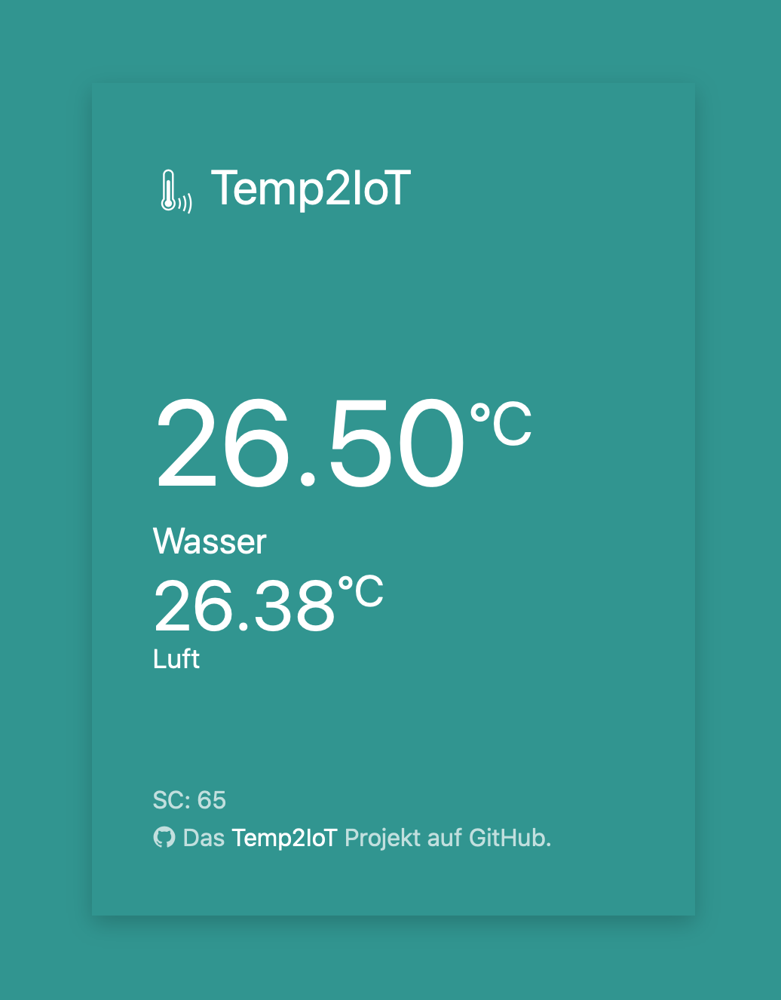

# Temp2IoT
Very basic IoT thermometer with REST API and Web-UI. Implemented according to the "KISS" approach - **K**eep **I**t **S**imple and **S**tupid

## Features
* Temperature measurement at one or two measuring points using DS18B20 sensors
* Shows the measured values on integrated Web UI
* REST API for integration with master systems (e.g. ioBroker)
* Configuration also via a Web UI


## Hardware

### BOM

| Description          | Qty.   | Price     | ASIN (partner-link from amazon.de)    |
|----------------------|--------|----------:|---------------------------------------|
| WeMos D1 mini        | 1      | EUR 5,99  | [B01N9RXGHY](https://amzn.to/3clRAiP) |
| DS18B20 waterproof   | 1 or 2 | EUR 3,25  | [B01MZG48OE](https://amzn.to/2NQUkvc) |
| Resistor 2K2 (0,6 W) | 1      | EUR 0,99  | [B007R3QXUE](https://amzn.to/3ja1jww) |
|----------------------|--------|-----------|---------------------------------------|
| Total                |        | EUR 10,23 |                                       |

*quoted prices from 2021/06/24*

Also a USB-micro cable and a USB power supply is required

### Wiring


### Power Supply
:warning: Caution Danger to life :warning:

If the thermometer is used to measure water temperatures, it is essential to use an appropriately classified power supply unit. It is important that the power supply is designed as a safety transformer.


Symbol of a short-circuit proof, closed safety transformer 

### Photos


Minimal build up with SMD resistor on the back and only one connected DS18B20. 

## Setup

You have two options to upload the software to the WeMos D1 mini.

### ESP8266 Flasher (Windows)

You can download the compiled Flasher Tool from the GitHub Repository
* [nodemcu/nodemcu-flasher](https://github.com/nodemcu/nodemcu-flasher)

1. Clone or download the repository
2. Start the ESP8266Flasher.exe
3. Select the pre-compiled Temp2IoT binary on the config-tab, find at: `src\Temp2IoT\emp2IoT.ino.d1_mini.bin`
4. Switch back to the operation-tab and select the right COM-port
5. Press the Flash-Button

### Arduino IDE

If no WeMos D1 mini have been programmed with the Arduino IDE so far, an appropriate setup is required first.
* [Wiki - Setup Arduino IDE for WeMos D1 mini](https://github.com/100prznt/Temp2IoT/wiki/Setup-Arduino-IDE)

1. Clone or download the repository
2. Open the `src\Temp2IoT\Temp2IoT.ino` with the Arduino IDE
3. Compile and upload
4. Scan for WiFi networks and try to connect the WiFi with SSID: "Temp2IoT"
5. Select your local WiFi from the list, enter your passwort an save the configuration
6. Open the serial monitor (in Arduino IDE) to see the WiFi status and the applied IP address


## REST API
* URL: `http://<Temp2IoT IP>/api`
* Method: `GET`

```
{
  "systemname": "Temp2IoT",
  "secure_counter": 999,
  "firmware": "2.0a",
  "sensors": [
    {
      "name": "name of sensor 1",
      "value": "25.44",
      "unit": "Celsius",
      "time": "Thu Jun 24 20:15:00 2021"
    },
    {
      "name": "name of sensor 2",
      "value": "25.25",
      "unit": "Celsius",
      "time": "Thu Jun 24 20:15:05 2021"
    }
  ]
}
```

## Web UI
* URL: `http://<Temp2IoT IP>/`
  <br>
  <br>
  <br>

Web UI on a desktop browser
  <br>
  <br>
  <br>

Web UI on a smartphone browser

## System Setup
* URL: `http://<Temp2IoT IP>/setup/`
  <br>
  <br>
  <br>

Setup page on a smartphone browser

## Color Scheme
          

### Colors

| # | scheme   | primary color | badge                                                   |
|:--|:---------|:--------------|---------------------------------------------------------|
| 1 | 100prznt | `#ff2e64`     |  |
| 2 | Classic  | `#1e87f0`     |  |
| 3 | Total    | `#30a4a1`     |  |
| 4 | Power    | `#325c84`     |  |
| 5 | Sun      | `#f08a00`     |  |
| 6 | Dark     | `#060d2a`     |  |


## Debug Output

Feel free to take a look at the serial monitor (115200 baud).

```
21:54:57.656 ->
21:54:57.656 ->        _____               ___ ___    _____       
21:54:57.656 ->       |_   _|__ _ __  _ __|_  )_ _|__|_   _|      
21:54:57.702 ->         | |/ -_) '  \| '_ \/ / | |/ _ \| |        
21:54:57.702 ->         |_|\___|_|_|_| .__/___|___\___/|_|        
21:54:57.702 ->                      |_|                          
21:54:57.702 -> 
21:54:57.702 -> **************************************************
21:54:57.702 ->        a 100prznt.de project by E. Ruemmler       
21:54:57.702 ->                       v2.2.04-b
21:54:57.702 -> 
```

## Enclosure
In the folder [hardware/enclosure](hardware/enclosure) you will find 2 STL files of a suitable enclosure. If the cover is printed upside-down, you can print the first two layers in a different color to make the Temp2IoT icon stand out better.

### Photos


3d-printed enclousure with Temp2IoT icon
  <br>
  <br>

Blackened inside so that the LED produces a focused light spot

## Community
Found this project on the german [Poolpowershop-Forum](https://www.poolpowershop-forum.de/).
* [WiFi Thermometer für 10 Euro selbst gebaut (Web UI, REST API)](https://www.poolpowershop-forum.de/forum/thread/1103493-wifi-thermometer-f%C3%BCr-10-euro-selbst-gebaut-web-ui-rest-api/)

## Credits
This app is made possible by contributions from:
* [Elias Rümmler](http://www.100prznt.de) ([@rmmlr](https://github.com/rmmlr)) - core contributor

### Open Source Project Credits

* [Follower Counter](https://github.com/jegade/followercounter) - The arc of this project based on a awesome code from [@jegade](https://github.com/jegade)
* Used Arduino libraries are described in the code

## License
The Temp2IoT project is licensed under [MIT](http://www.opensource.org/licenses/mit-license.php "Read more about the MIT license form"). Refer to [LICENSE.txt](https://github.com/100prznt/Temp2IoT/blob/master/LICENSE.txt) for more information.

## Contributions
Contributions are welcome. Fork this repository and send a pull request if you have something useful to add.
