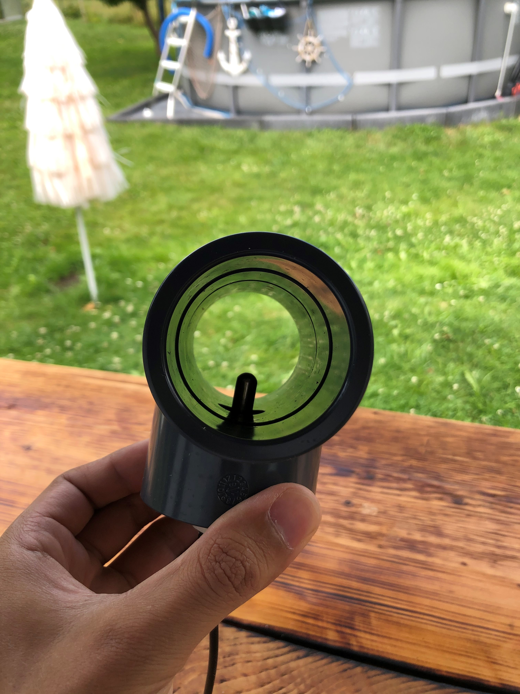

# Temp2IoT
Very basic IoT thermometer with REST API and Web-UI. Implemented according to the "KISS" approach - **K**eep **I**t **S**imple and **S**tupid

* Go to Project [README.md](https://github.com/100prznt/Temp2IoT)

## Tauchhülse
Möchte man die Wassertemperatur im geschlossenen Kreislauf erfassen bietet sich der Einsatz einer Tauchhülse an. Eine solche Tauchhülse kann zum Beispiel in ein T-Stück mit reduzierten Abgang eingeschraubt werden.

Im Vergleich zu einen außenliegenden Anlegefühler erreicht man mit der Tauchhülse eine wesentlich bessere Dynamik. Die dünnwandige Edelstahl-Hülse leitet wäre einfach besser als ein dickwandiges PVC Rohr.

## BOM

| Description           | Qty. | Price     | ASIN (partner-link from amazon.de)     |
|:----------------------|:-----|----------:|:---------------------------------------|
| Tauchhülse 1/2" 50 mm | 1    | EUR 10,99 | [ B07DXFWV6B](https://amzn.to/3eissJy) |

*quoted prices from 2021/04/19*

## Photos

Im T-Stück eingesetzte Tauchhülse mit 1/2" Gewinde
   
   
   

Mit 50 mm Länge ragt die Hülse minimal in den Hautstrom. Tieferes Eintauchen erhöht das Risiko das sich Haare festsetzen.
