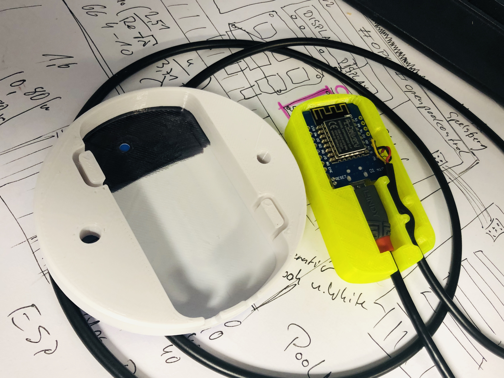

# Temp2IoT Enclosure

The enclosure is optimized for the use of a LINDY *Anthra Line Anthrazit* USB cable.

Partner-link from amazon.de
* [LINDY 36734 3m USB 2.0 Typ A an Micro-B Kabel](https://amzn.to/2YbEmhI)

## Assembly

If the cover is printed in a bright color, it can be blackened from the inside to prevent the LED from causing unpleasant stray light.

